# Analyse - Design Web

## Liens des refontes
-
-
-
-

## CC Welkenraedt :

https://www.ccwelkenraedt.be/

## Présentation du site

Site présentant tous les événements qui se déroulent dans le Centre culturel de Welkenraedt (théâtre, cinéma,
expositions,...)

## Objectifs du site

Vendre des places pour les événements

## Public cible

- Toute personne s'intéressant à la culture
- Les écoles

---

## Tests Utilisateurs

### Utilisateur 1

Prénom : Sarah Âge : 26 Fonction : Travaille dans une entreprise d'analyse en biologie moléculaire Elle navigue souvent
sur le web sur son ordinateur mais n'a jamais fréquenté ce site Technologie : elle a l'habitude d'utiliser un ordinateur
pour le travail. Durant son temps libre, elle utilise beaucoup son téléphone et navigue tous les jours sur le web. Elle
n'avait jamais visité ce site avant. Elle a réalisé le test sur smartphone

### Utilisateurs 2

nom : Yasemin Karadeniz age : 23 ans Etude : étudiante en Techniques Graphiques orientation 3D

### Utilisateurs 3

Prénom : Martine Lefrançois Âge : 54 ans Fonction : Claire de Notaire

### Utilisateurs 4

Nom: Droeven Sonia Âge: 53 ans Métier: Enseignante primaire 1er 2eme

### Scénarios

1. Votre soeur fête son anniversaire le 27 mars, pour cette évènement vous aimeriez l'inviter voir une pièce de théatre
   qui se déroule au centre culturel de Welkenraedt. Vous voudriez donc réserver 2 places de spectacle aux alentours de
   cette date.
2. Après le spectacle, votre soeur se rend compte qu'elle a oublié son téléphone, vous voulez donc contacter le centre
   culturel pour savoir s'ils ne l'ont pas mis de côté
   (la salle en question est "Pierre Raspat", qui est la salle pour spectacle).

### Problèmes des utilisateurs :

- Pas de jour de la semaine pour l'événement (1)
- Réservation "prév.J/S" = ?? => pas d'indication (indication en infobulles) (1)
- Réservation : place (case colorée?) => légende
- Mettre effet hover pour les jours où il y a un événement dans le calendrier
- Contact : pas de formulaire de contact, mais un formulaire pour newsletter
- Adresse mail et téléphone non cliquable :/
- Pas de mise en évidence pour le lien du menu lorsqu'on est sur la page

### Problèmes que nous avons remarqués en plus

- Fil d'arianne > 2e lien pas bon (places)
- Triangle dans menu reseemblant à la flèche menu déroulant alors que c'est juste une décoration
- Menu nav > onglet > pas de hover pour mettre
- Certains liens de le slider au dessus du footer ne fonctionne pas/ne redirige pas ou ne sont pas à jours.

---

## Test d'utilisabilité d'Amélie Boucher

### Architecture : Le site est bien rangé.

#### Les regroupements sont logiques.

- L'architecture est plutôt bien rangée. Chaques rubriques contient bien des infos sur le titre de la rubrique.

#### La structuration met en avant les contenus clés.

- OK

#### Les menus aident l'internaute à naviguer dans les contenus.

- OK

### Organisation visuelle : la page est bien rangée.

#### Éviter le trop-plein d'information.

- OK, peu de texte sur l'ensemble du site.

#### Réduire la quantité de mots sur les pages navigantes.

- OK

#### N'afficher que les principaux éléments de navigation et d'interaction.

- OK

#### Différencier les quantités d'informations réelles et perçues.

- La quantité d'information est bien gérée.

#### Les animations augmentent la charge informationnelle.

- Les deux sliders s'arrêtent lors du survole du curseur.

#### Démultiplier la valeur du pixel carré.

- Il y a les boutons des sliders pour changer d'info.

### Cohérence : le site capitalise sur l'apprentissage interne.

#### Les localisations sont cohérentes.

- La localisation est cohérente, les objets ne changent pas de place.

#### Les appellations sont cohérentes.

- Les appellations sont cohérentes.

#### Les formats de présentation sont cohérents.

- Les styles sont les mêmes sur toutes les pages.

#### Les interactions sont cohérentes.

- Idem.

### Conventions : le site capitalise sur l'apprentissage externe.

#### Respecter les conventions de localisations.

- Conventions respectées.

#### Respecter les conventions de vocabulaire.

- Le vocabulaire est bon.

### Information : le site informe internaute et lui répond.

#### Ne soyez pas avare d'informations.

- Peu de texte finalement, mais ça n'est pas gênant. Manque les dates dans la réservation des tickets.

#### Donner de l'information générale.

- OK, lien cliquable pour avoir plus d'infos.

#### Donner de l'information pour faciliter la navigation.

- Bonne navigation.

#### Donner de l'information ponctuelle.

- Pas de formulaire de contact. Le formulaire de newsletter informe bien de l'envoi validé et des erreurs.

#### Informez, mais au bon moment.

- OK

#### L'ordinateur répond aux actions de l'internaute.

- Feedback lors des formulaires si on ne complète pas tous les champs.

#### Visibilité du feedback.

- Il s'affiche en message d'erreur ou en message validé.

### Compréhension : les mots et symboles sont choisis minutieusement.

#### Le vocabulaire doit être compréhensible.

- Bon vocabulaire

#### Les symboles de codes doivent être compréhensibles.

- Triangles dans la navigation, on se demande quoi.

### Assistance : le site aide et dirige l'internaute.

#### Call-To-Action.

- CTA corrects

### Gestion des erreurs : Le site prévoit que l'internaute se trompe.

#### Éviter les erreurs grâce à l'indication des champs obligatoires.

- Formulaire, champs essentiels sont obligatoires. On peut mettre n'importe quoi dans le nom, prénom, adresse.

#### Éviter les erreurs grâce aux libellés et légendes des champs.

- Les champs sont légendés.

#### Éviter les erreurs grâce à la taille des champs.

- La taille est correcte.

#### Faciliter le repérage des erreurs.

- texte rouge, erreur bien expliquée. Champs rouge aurait été sympa.

#### Faire preuve de courtoisie dans les messages d'erreurs.

- C'est courtois.

#### L'internaute doit facilement pouvoir corriger ses erreurs.

- Corrige simplement.

### Rapidité : l'internaute ne perd pas son temps.

#### Faciliter les interactions.

- Padding ok sauf exception. Hover trop faible.

### Liberté : c'est l'internaute qui commande.

#### Respectez les contrôles utilisateur conventionnels.

- Fonctionnalités du navigateur fonctionnelles sauf certains navigateurs sur certains OS.

#### Fuyez les actions au rollover.

- Il y a du rollover sans hover.

### Accessibilité : un site facile d'accès pour tous.

- VoiceOver de MacOS fonctionne.
- TAB fonctionne à moitié. (suivant navigateur et OS)

### Satisfaction de votre internaute

- On arrive à faire ce que l'on veut.

---

### Test d'Anysurfer.

| Numéro      |     Description                                                                                        |   Poids | Résultat |
| ----------- | ------------------------------------------------------------------------------------------------------ | ------- |----------|
| 1           |        Les titres de pages sont-ils significatifs ?                                                    |       1 | 1        |
| 2           |        La langue des pages est-elle correctement indiquée ?                                            |       2 | 2        |
| 3           |        Le focus est-il visible lors de la tabulation ?                                                 |       2 | 0        |
| 4           |        Le site est-il entièrement utilisable au clavier ?                                              |       3 | 0        |
| 5           |        Est-il possible d'arrêter les animations ?                                                      |       2 | 2        |
| 6           |        La différence entre les liens et le simple texte est-elle visuellement claire ?                 |       1 | 0        |
| 7           |        Les intitulés des liens sont-ils significatifs ?                                                |       2 | 2        |
| 8           |        Toutes les images ont-elle une alternative textuelle ?                                         |       2 | 0        | 
| 9           |        Les vidéos sont-elles sous-titrées ?                                                            |       3 | -       |
| 10          |        Le contraste entre le texte et l'arrière-plan est-il suffisant ?                                |       3 | 0        |
| 11          |        Les titres sont-ils codés au moyen des balises HTML adéquates ?                                 |       2 | 0        |
| 12          |        Les listes sont-elles codées au moyen des balises HTML adéquates ?                              |       1 | 1        |
| 13          |        Les champs de formulaire sont-ils reliés à leur label ?                                         |       2 | 0        | 
| 14          |        Une aide textuelle est-elle présente lorsque la validation d'un formulaire détecte des erreurs ?|       2 | 2        |
| 15          |        Le code source est-il valide ?                                                                   |       1 | 0        |

Total : 10/26 = 38%

3) Ok pour Chrome mais pas pour Safari ni Firefox(MacOS)
4) Ok pour Chrome mais pas pour Safari ni Firefox
8) Logo
10) "Plus d'info" sur image | Bouton "abonnement - réservation"
11) h1/h2 manquants dans certaines pages
15) Balises non fermées, pas d'unité en css, label.

---  

### HeadingsMap

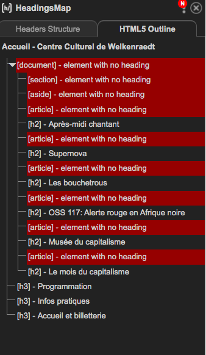
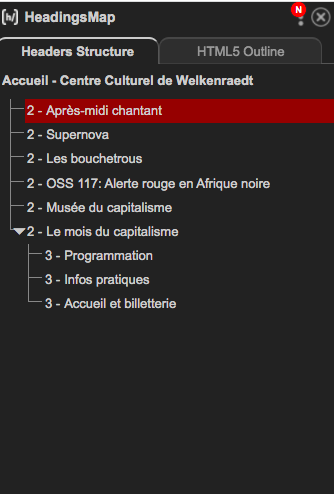
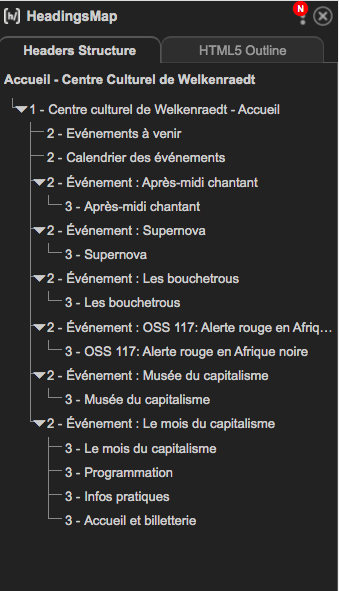
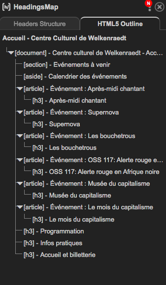

### GTMetrix

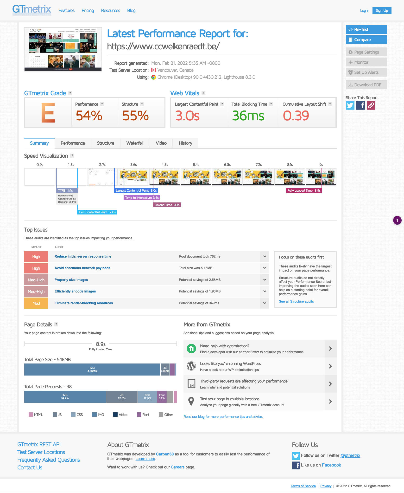
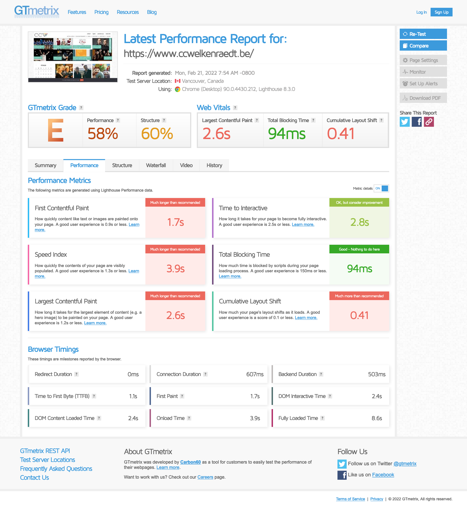
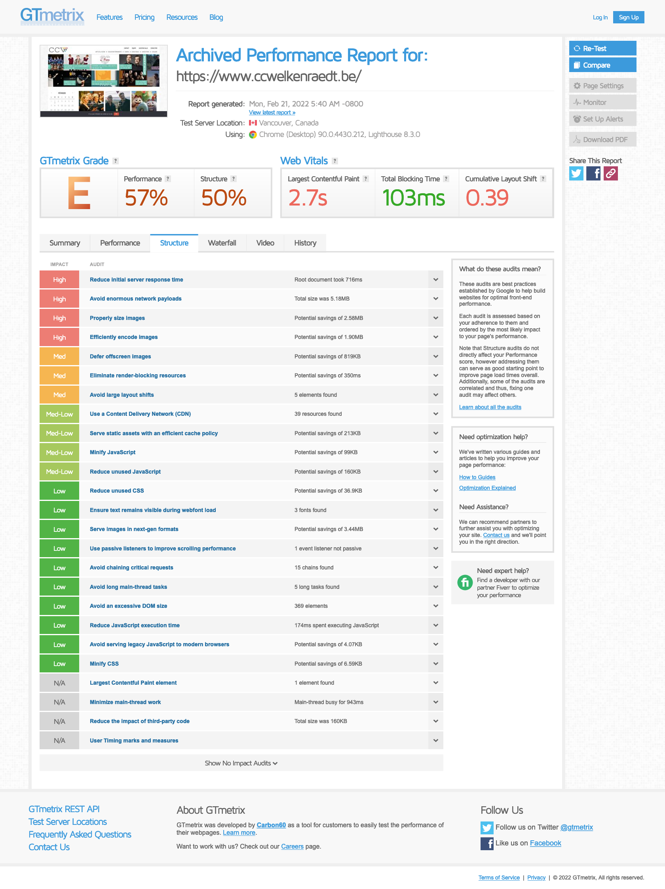
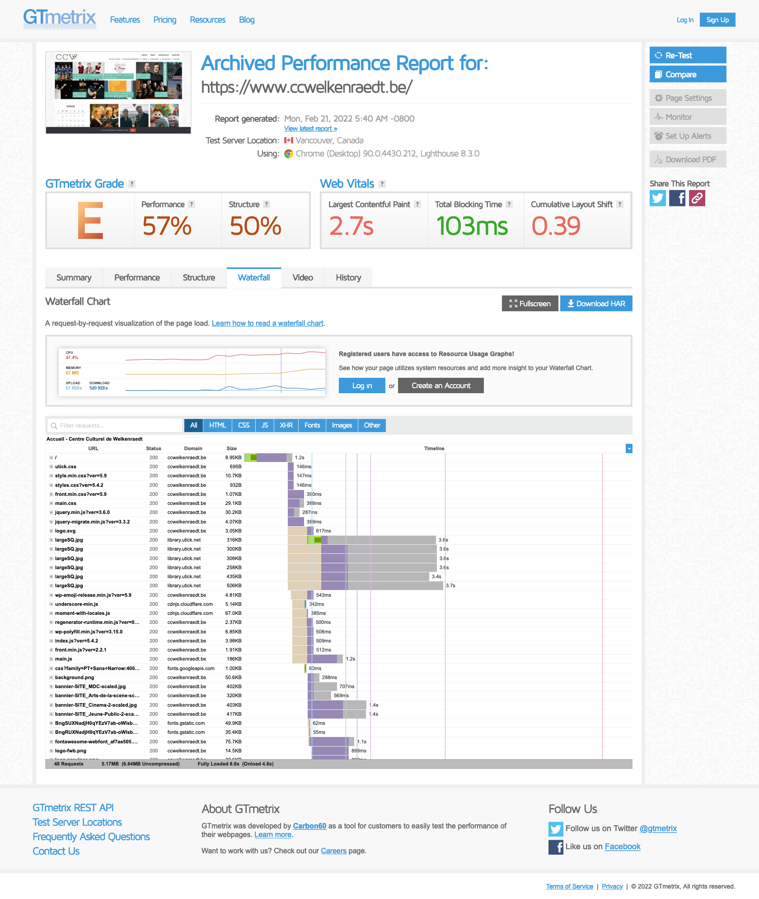
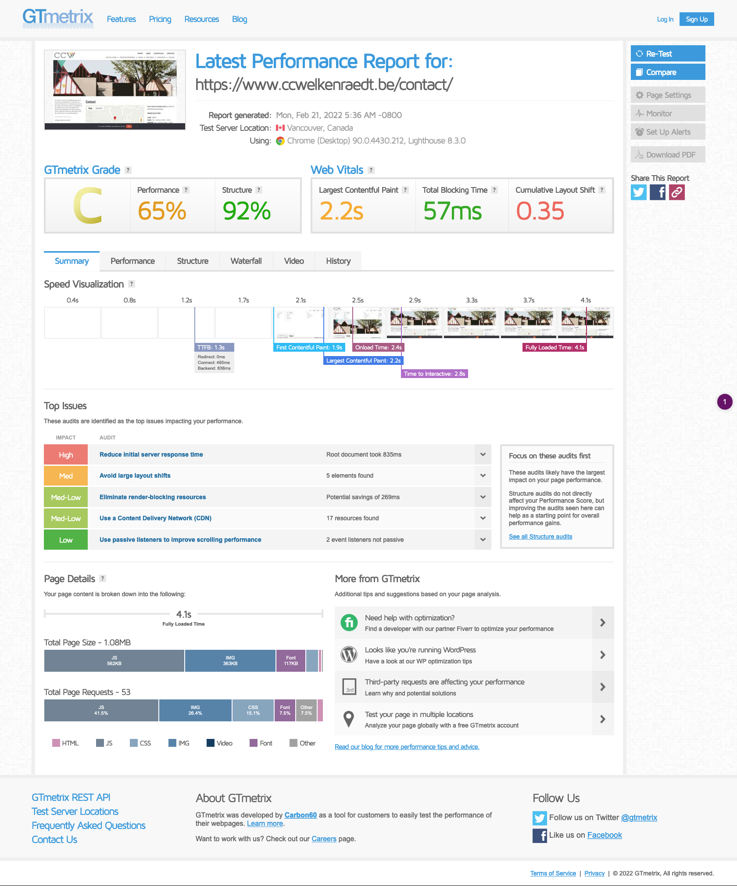
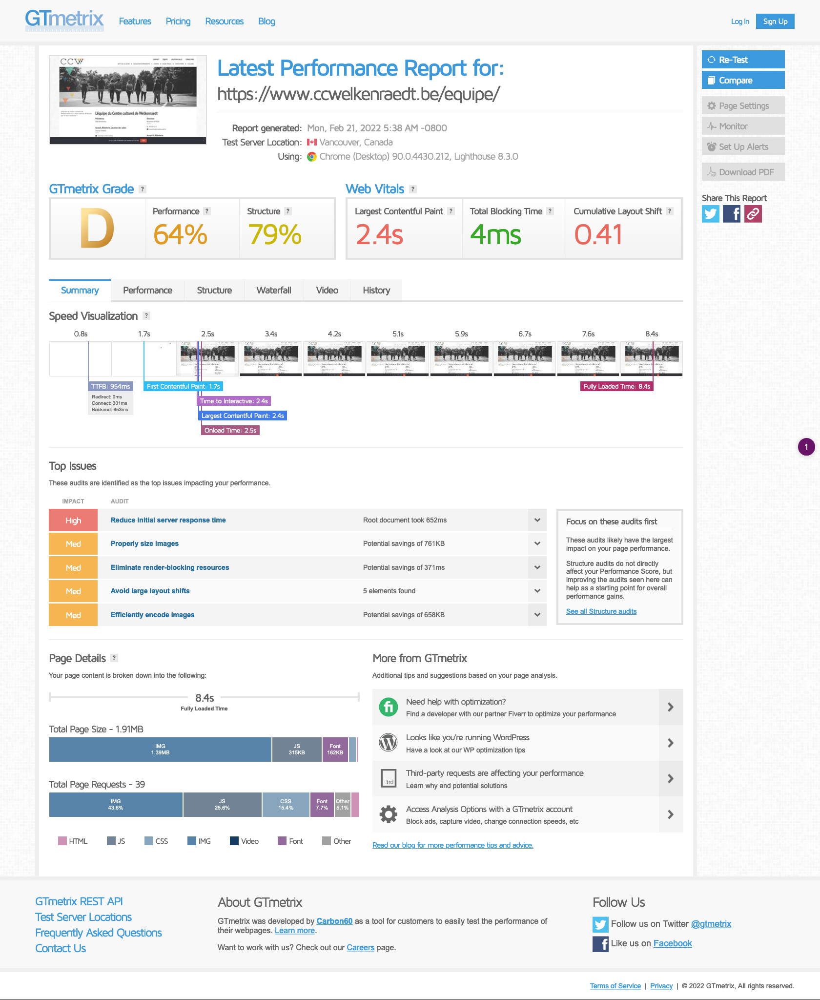
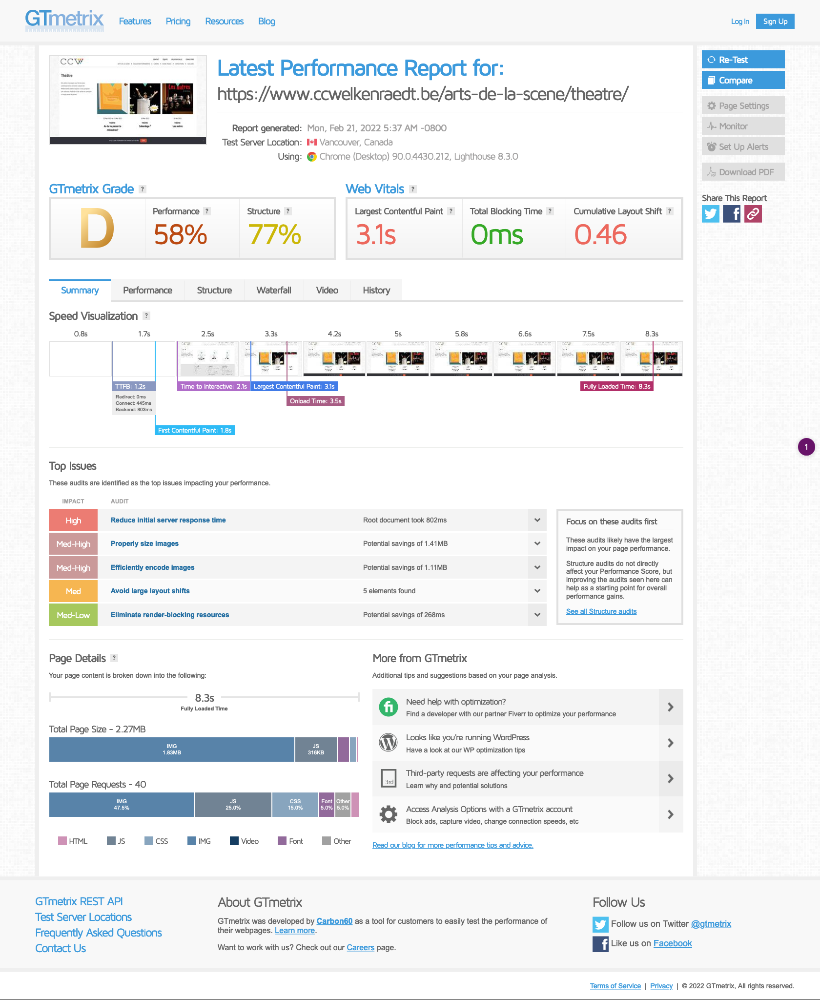

### Carbon Calculator

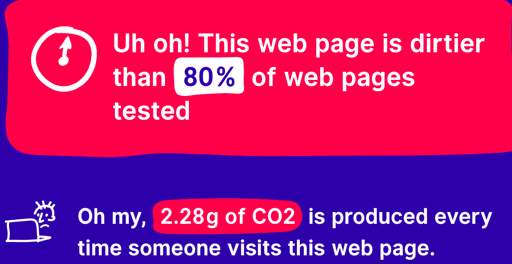

### Microdata

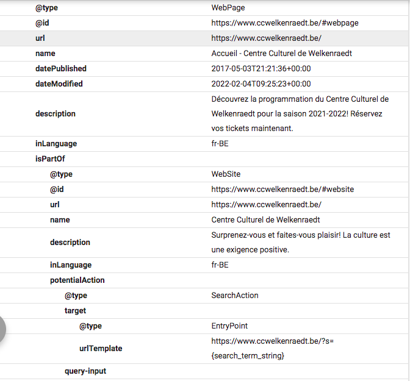
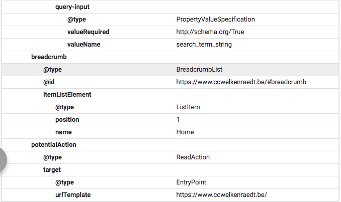

### Responsive

Oui :D

---

